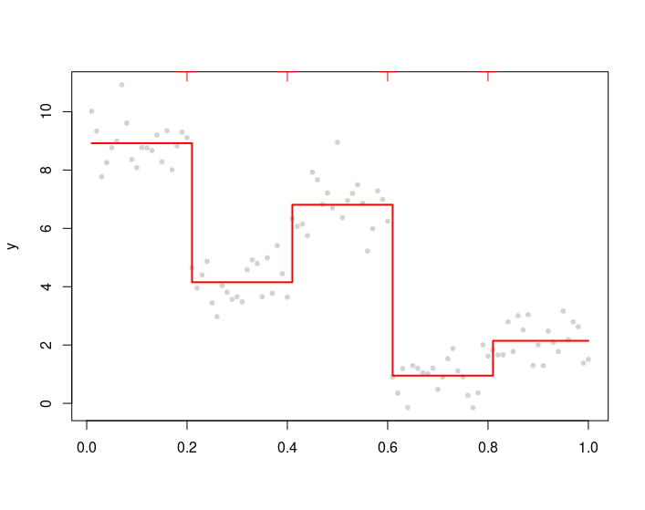

[](https://pubsonline.informs.org/journal/ijoc)

# $\ell_0$ Trend Filtering

This archive is distributed in association with the [INFORMS Journal on
Computing](https://pubsonline.informs.org/journal/ijoc) under the [MIT License](LICENSE).

The software and R scripts in this repository are a snapshot of the software and code that were used in the research reported on in the paper 
**$\ell_0$ Trend Filtering** by C. Wen and X. Wang and A. Zhang. 

**Important: This code is being developed on an on-going basis at https://github.com/C2S2-HF/L0TF. Please go there if you would like to
get a more recent version or would like support.**

## Cite

To cite the contents of this repository, please cite both the paper and this repo, using their respective DOIs.

https://doi.org/10.1287/ijoc.2021.0313

https://doi.org/10.1287/ijoc.2021.0313.cd

Below is the BibTex for citing this snapshot of the respoitory.

```
@article{wenl0trend,
  author =        {Canhong Wen, Xueqin Wang, Aijun Zhang},
  publisher =     {INFORMS Journal on Computing},
  title =         {$\ell_0$ Trend Filtering},
  year =          {2023},
  doi =           {10.1287/ijoc.2021.0313.cd},
  url =           {https://github.com/INFORMSJoC/2021.0313},
}  
```

## Description

The goal of this repository is to share softare and R scripts of our paper $\ell_0$ *Trend Filtering*. Our motivation is to present our code and results in a reproducible way and facilitate the coding effort of those who want to run further experiments or improve our model.

## Requirements

To run the R scripts in the [code](code) folder, you should install R and RStudio firstly:
 - [R](https://cran.rstudio.com/)(>3.3.0)
 - [RStudio](https://posit.co/downloads/)
 
In Windows, you will need to install some additional software tools to build and install the `AMIAS` package, which implement the main algorithm of our paper. 
- The Rtools is a collection of build tools, a compiler toolchain, headers and pre-compiled static libraries, and is  used for building R packages from source (those that need compilation of C/C++ or Fortran code). You could download Rtools at [Rtools](http://lib.stat.cmu.edu/R/CRAN/bin/windows/Rtools/). After downloading, double click `Rtools.exe` to install it and its accompanying tools: minGW, perl. Rtools automatically recognizes the paths of those relevant softwares and add them to the environment variables of your computer. For more details on the installation of Rtools, please go to the website [http://lib.stat.cmu.edu/R/CRAN/bin/windows/Rtools/rtools43/rtools.html](http://lib.stat.cmu.edu/R/CRAN/bin/windows/Rtools/rtools43/rtools.html).
- In order to make a nicer outlook for the help documents, you might download and install LaTex and Microsoft HTML Help Workshop and the Inno Setup installer, available at http://www.miktex.org, and http://msdn.microsoft.com/en-us/library/ms669985.aspx, respectively. 

## Installation

The `AMIAS` R package implements the algorithm proposed in the paper $\ell_0$ *Trend Filtering* with R language. 

Once the repo is locally cloned, you can follow the following steps to install the `AMIAS` R package:

1. Open a terminal window
2. Go to the directory that contains AMIAS/ directory.
   Type
   ```
   R CMD build AMIAS
   ```
   The the user will see something like this
   ```
   * checking for file ‘AMIAS/DESCRIPTION’ ... OK
   * preparing ‘AMIAS’:
   * checking DESCRIPTION meta-information ... OK
   * cleaning src
   * checking for LF line-endings in source and make files and shell scripts
   * checking for empty or unneeded directories
   * building ‘AMIAS_1.0.3.tar.gz’
   ```
   and a *AMIAS_1.0.3.tar.gz* file will be there.

3. Type
   ```
   R CMD INSTALL AMIAS_1.0.3.tar.gz
   ```
   to install the package.

Alternatively, you could directly install it from Github without downloading it manually. Start R and type
```r
if(!require(devtools)) install.packages('devtools')
devtools::install_github("INFORMSJoC/2021.0313/scripts/AMIAS")
```
or
```r
if(!require(devtools)) install.packages('devtools')
devtools::install_github("C2S2-HF/L0TF/scripts/AMIAS")
```
to install the package.

After installation, you can start R and run the following code to see that it was indeed installed:
```r
library(AMIAS)
set.seed(0)
n <- 100
alpha0 <- rep(sample(1:10,5), each = n/5)
y = alpha0 + rnorm(n, sd = 0.8)

fit <- amias(y, k = 4, A = seq(20, 80, length.out = 4))
plot(fit)
```
A figure like this should be plotted:

[](results/demo_install.png)

For help in using the functions (say `amias`) in this R package, just run `?amias` or `help("amias")` in R or RStudio and a detailed documentation including usage and arguments is provided.

## Repository Structure

#### [code](code) folder contains the following files in R language:
* [AMIAS](scripts/AMIAS) folder: the source codes for developing an R package to implement the AMIAS algorithm proposed in our paper. 
* SimuL0TF.Rmd: generate Figures 2-7 and include some more illustrative simulated examples.
* AlgoAnalysis.Rmd: replicate the reuslts and generate Figures 8-11 in Section 4.1.
* utils.R and amiasutils.R: source codes used in AlgoAnalysis.Rmd.
* RealData.R: replicate the results and generate all the graphs in Section 4.3.
* AlgoAnalysis_APP.Rmd: replicate the reuslts and generate Figures B.1-B.7 in Appendix B.1.
* [simu](scripts/simu) folder contains R scripts used in Appendix B.2: 
    * nsimu.R and tsimu.R: replicate the results for all methods except for the l0-MIP with large sample size.
    * nsimul0tfc.R and tsimul0tfc.R: replicate the results of the l0-MIP method when sample size is large.
* [simu_plots](scripts/simu_plots) folder contains the R Scripts used to generate Figures B.9-B.20 in Appendix B.2.
    * post_plot.R: generate Figures B.9, B.11 and B.13. 
    * pre_plot.R: generate Figures B.10, B.12 and B.14.
    * post_tplot.R: generate Figures B.15, B.17 and B.19. 
    * pre_tplot.R: generate Figures B.16, B.18 and B.20. 
    * combine_RData.R: combine the RData and needed to be run before generating all the figures.
    
#### [data](data) folder contains the data in the real data application in Section 4.2. Please see [spreadsheet file](data/air_hourly.csv) to view the data.

#### [results](results) folder contains all the figures in our paper.


## Support
For support in using the scripts and data, submit an [issue](https://github.com/C2S2-HF/L0TF/issues/new).


